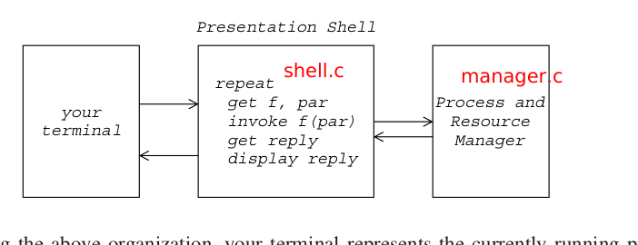

# Basic Processes and Resources Manager


## File Structure

file:
- makefile
- manager.h
- manager.c
- shell.c
- README.md

## System Design



## Features

## Usage

```bash
git clone git@github.com:Thomison/process-and-resource-manager.git

cd process-and-resource-manager

make

./test_shell or ./test_shell input
```

## Manager

### PCB

structure of process control block:
- id: present the unique process identifier.
- resources: present all resources other than main memory.
- status
    - type: present ready or blocked.
    - list: present ready list or blocked list in kernel.
- creation_tree 
    - parent: present the parent process.
    - child: present the child process list.
- priority: present the priority of process.

### RCB

structure of resource control block:
- id: present the unique resource identifier.
- status
    - k: present initial number of resource.
    - u: present available number of resource.
- waiting_list: present the waiting processes of resource.

### Process Operations

operations of process.
- `create`: create a new process.
- `destroy`: destroy the target process.

### Resource Operations

operations of resource.
- `request`: currently running process request a certain number of resources.
- `release`: currently running process release a certain number of resources.

## Shell

commands usage of presentation shell:
- `init`: initilize manager
- `cr <process name> <priority>`: create process 
- `de <process name>`:  delete process
- `req <resource> <# of units>`:  request resource
- `rel <resource name> <# of units>`: release resource
- `to`:  time-out interrupt
- `list ready`: list all process in ready list
- `list block`: list all process in blocked list
- `list res`:  list all available resources
- `pr <process name>`: print pcb information about a given process

ps: `<# of units>` is optional and the default is `1`.


## Init

- the first command of system must be `init` command.
- there are four kinds of resources (R1, R2, R3, R4), and their initail
    number are `Ri` (R1=1, R2=2, R3=3, R4=4).
- the process id of `init` process is `1`.

